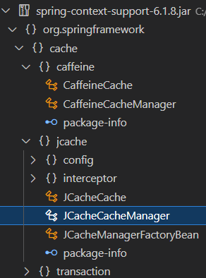

## 레시피 b-01-iv Ehcache로 캐싱 구현하기 -  Spring 6.x + Ehcache 3.x

> ...

### 이번 레시피에서 확인해야할  내용

* ✖️ **b-01-i**:  캐싱이 필요한 예제 준비 - Spring 5 예제와 동일해서 추가하지 않음.

* ✔ **b-01-ii**:  스프링 없이 Ehcache 적용 

* ✔ **b-01-iii**:  스프링으로 Ehcache 사용

* ✅ **b-01-iv**:  스프링으로 Ehcache 구성

  


## 진행

이번에는 진짜 스프링으로 Ehcache 구성하는 예제

* 디펜던시 추가

  ```groovy
  implementation 'org.springframework:spring-context-support'
  ```

  


## 의견

* 구성 클래스에서는 net.sf 로 시작하는 Ehcache의 클레스가 제거가 되었지만 아직 사용처에서 완전히 제거되진 않았다.
  * 이후 예제에서 스프링의 캐시 추상화 클래스로 제거할 것 같다.


### 💡 Spring 6.x + Ehcache 3.x 변경 관련 사항

Spring 6 에서는 `EhCacheFactoryBean` 클래스가 제거되었다.

* `spring-context-support`에 cache 패키지의 클래스를 보면 jcache와 caffeine 2가지만 있다.

  

  

  * 💡Spring 6 환경에서는 결국 JCache를 사용하고 구현체로 Ehcache를 사용해야할 것 같다.

설정 클래스는 거의 Spring 5의 코드를 기준으로 짜맞추기로 바꾸긴 했는데.. 실행을 해보았을 때.. 특별한 문제는 없었다.

```java
  @Bean
  JCacheManagerFactoryBean cacheManager() {
    try {
      JCacheManagerFactoryBean factory = new JCacheManagerFactoryBean();
      factory.setCacheManagerUri(new ClassPathResource("ehcache.xml").getURI());
      return factory;
    } catch (IOException e) {
      throw new IllegalStateException("Failed to load Ehcache configuration", e);
    }
  }

  @Bean
  Cache calculationsCache() {
    JCacheCacheManager jCacheCacheManager =
        new JCacheCacheManager(Objects.requireNonNull(cacheManager().getObject()));
    return jCacheCacheManager.getCache("calculations");
  }

  @Bean
  CalculationService calculationService() {
    return new PlainCachingCalculationService(calculationsCache());
  }
```

지금 설정으로는 구성 설정 및, 사용처에서도 javax.cache나 org.ehcache 패키지 의존 클래스들이 전부 제거되고, 스프링 클래스만 있다.

* JCache 모드라도 ehcache.xml 설정 파일은 그대로 사용할 수 있었다.


---

## 기타

* ...

  

## 정오표

* ...
  


---

## JavaDocs

* ...


---

### 문서 사용 아이콘

* ✅: Current Done
* ✔: Done
* ⬜: TODO
* ✖️: Skip
* ...

