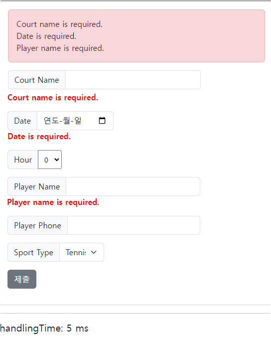

## 레시피 3-09-i 컨트롤러에서 폼 처리하기 (ii~iv 예제 포함)

> [3-08-iii](../recipe-3-08-iii)  예제에서 이미 Form 페이지가 있고, Spring Form 테그도 쓰고 있긴해서, 특별히 해줄일이 없긴한데.. 
>
> Validator 동작 확인하고, webjars BootStrap을 적용해서 간단하게 디자인을 바꿔보자.
>
> 💡3-09-ii ~ iv 내용도 포함. 
>
> * 3-09-ii의 내용을 3-09-i에 포함했다.
> * 아래 내용이 이미 포함되어있음.
>   * 폼 서비스
>   * 폼 컨트롤러
>   * 모델 속성 객체를 초기화하고 폼값 미리채우기
>   * 폼에 레퍼런스 데이터 제공하기
>   * 커스텀 타입 프로퍼티 바인딩하기
>   * 폼 데이터 검증하기
>     * `@InitBinder` 설정 메서드에서 validater 설정
>   * 컨트롤러의 세션 데이터 만료 시키기
>
> 역자님 예제를 보았을 때... iv의 내용까지 이번 i예제에 전부 다 진행을 했다. ii~iv는 만들필요 없을 듯.
>
> 역자님 예제를 봤을 때, 3-10에서 할 내용이 미완성인 채로 붙어있는 것 같은데.. 그부분은 따라하지 않았다.


### 이번 레시피에서 확인해야할  내용

* ...

  

## 진행

### 1. Bootstrap 스타일 적용

좀 보기 좋게 되긴 했다... 😂




## 의견

* ...


## 기타

### Virtual IP > \[여러대 WAS] 환경이라면...  `@SessionAttributes` 를 쓸때 조심 해야할 부분이 있음.

* #### 💡 빙과의 대화 

   Spring에서 `@SessionAttributes`를 사용할 때.. 구성환경이  Virtual IP 하나를 바라보는 여러대의 WAS 구성인경우 고려해야할 부분이 있지 않니?

  ---

  > Spring에서 `@SessionAttributes`를 사용할 때, Virtual IP 하나를 바라보는 여러대의 WAS 구성인 경우에는 세션 클러스터링이나 스티키 세션 같은 기술을 고려해야 할 수 있습니다.
  >
  > 세션 클러스터링은 여러 서버 간에 세션 정보를 공유하는 방법으로, 한 서버에서 생성된 세션을 다른 서버에서도 인식할 수 있게 해줍니다. 이 방법은 서버 간의 세션 정보 동기화에 대한 처리가 필요합니다.
  >
  > 스티키 세션은 사용자의 모든 요청을 처음 요청을 처리한 서버로만 전달하는 방식입니다. 이 방법은 특정 서버에 과도한 부하를 주거나 서버가 다운되면 문제가 될 수 있습니다.
  >
  > 또한, Spring Session과 같은 도구를 사용하여 세션 정보를 외부 저장소(예: Redis)에 저장하고 여러 WAS에서 공유하는 방법도 있습니다.
  >
  > 따라서, 이러한 기술들 중 어떤 것을 사용할지는 애플리케이션의 요구 사항과 인프라 구조에 따라 결정해야 합니다.
  >
  > 
  >
  > 그런데, `@SessionAttributes` 어노테이션 자체에 대해서는 몇 가지 주의할 점이 있습니다. `@SessionAttributes`는 컨트롤러 내에서만 세션 데이터를 유지하므로, 여러 컨트롤러 간에 데이터를 공유하거나, 오랫동안 데이터를 유지해야 하는 경우에는 적합하지 않을 수 있습니다. 또한, `@SessionAttributes`는 특정 컨트롤러 내에서만 작동하므로, 여러 컨트롤러에서 동일한 세션 데이터를 사용해야 하는 경우 HttpSession을 직접 사용하는 것이 좋습니다.

  ---

  `@SessionAttributes`를 폼 전송할 때만 쓰거든 그러면 스티키 세션도 나쁘진 않을 것 같은데... 폼전송이 완료하면 바로 complete로 끝냄.

  ---

  > 네, 폼 전송이 완료되면 세션을 바로 종료하는 경우라면 스티키 세션도 나쁘지 않을 수 있습니다. 스티키 세션은 사용자의 모든 요청을 처음 요청을 처리한 서버로만 전달하는 방식이므로, 세션 데이터의 일관성을 유지하는 데 유용합니다.
  >
  > 그러나 스티키 세션에는 몇 가지 주의할 점이 있습니다. 특정 서버에 과도한 부하가 가해질 수 있으며, 해당 서버가 다운되면 사용자가 서비스를 이용할 수 없게 됩니다. 따라서 부하 분산과 장애 복구 전략도 함께 고려해야 합니다.
  >
  > 또한, `@SessionAttributes`를 사용할 때는 세션 데이터의 생명주기를 잘 관리하는 것이 중요합니다. `@SessionAttributes`는 컨트롤러 범위의 세션 데이터를 관리하므로, 폼 전송이 완료된 후에는 반드시 세션에서 해당 데이터를 제거해야 합니다. 이렇게 하지 않으면 예상치 못한 동작이 발생할 수 있습니다.
  >
  > 따라서, 스프링에서 제공하는 `SessionStatus` 객체의 `setComplete()` 메소드를 사용하여 세션을 명시적으로 완료하고 `@SessionAttributes`에서 지정한 모든 속성을 제거하는 것이 좋습니다. 이렇게 하면 폼 전송이 완료된 후에도 세션 데이터가 남아있지 않아 다른 요청에서 문제가 발생하는 것을 방지할 수 있습니다.

  ---

  그런데 예전에 설정한 기억으로는 이게 특정 URL로만 스티키 세션을 설정할 수 있었는지는 확인을 해본적은 없는데... 특정 URL에 대해서만 스티키 세션을 사용할 수도 있니?

  ---

  > 특정 URL에 대해서만 스티키 세션을 사용하는 것은 일반적으로 로드 밸런서나 리버스 프록시 설정에 따라 다릅니다. 일부 로드 밸런서나 리버스 프록시는 세션 어피니티 설정을 URL 경로 레벨로 세분화하여 제공하는 기능을 가지고 있습니다.
  >
  > 예를 들어, AWS의 Application Load Balancer는 고정 세션 기능(세션 어피니티라고도 함)을 제공하며, 이를 사용하면 로드 밸런서가 사용자의 세션을 특정 대상에 바인딩하도록 할 수 있습니다. 이 기능은 클라이언트에게 지속적인 경험을 제공하기 위해 상태 정보를 유지하는 서버에 유용합니다.
  >
  > 그러나 일반적으로 이러한 설정은 전체 애플리케이션 또는 특정 서비스 레벨에서 적용되며, 특정 URL 경로에 대해서만 스티키 세션을 적용하는 것은 보다 복잡한 설정이 필요할 수 있습니다. 이는 사용하는 로드 밸런서나 리버스 프록시, 그리고 웹 애플리케이션의 구조에 따라 달라집니다.
  >
  > 따라서 특정 URL에 대해서만 스티키 세션을 적용하려면 해당 기능을 지원하는 로드 밸런서를 사용하거나, 웹 애플리케이션 또는 웹 서버 설정을 통해 세부적으로 조절해야 할 수 있습니다. 이에 대한 정확한 방법은 사용하는 기술 스택과 인프라에 따라 다르므로, 구체적인 방법을 알려드리기는 어렵습니다.

  ---

  전에 Apache Httpd 설정으로 했는데... 여기서 URL을 특정할 수 있었었는지 기억이 안남 😂

  ---

  > Apache Httpd에서 특정 URL에 대해 스티키 세션을 설정하는 것은 일반적으로 로드 밸런서나 리버스 프록시 설정에 따라 다릅니다. 일부 로드 밸런서나 리버스 프록시는 세션 어피니티 설정을 URL 경로 레벨로 세분화하여 제공하는 기능을 가지고 있습니다.
  >
  > 예를 들어, Apache Httpd에서는 mod_jk 모듈을 사용하여 AJP 프로토콜을 통해 Apache와 Tomcat을 연결하고, 이를 통해 로드 밸런싱과 스티키 세션을 설정할 수 있습니다. 이 경우, JkMount 지시어를 사용하여 특정 URL 패턴에 대한 요청을 특정 워커로 라우팅할 수 있습니다.
  >
  > 그러나 이러한 설정은 전체 애플리케이션 또는 특정 서비스 레벨에서 적용되며, 특정 URL 경로에 대해서만 스티키 세션을 적용하는 것은 보다 복잡한 설정이 필요할 수 있습니다. 이는 사용하는 로드 밸런서나 리버스 프록시, 그리고 웹 애플리케이션의 구조에 따라 달라집니다.

이래서 세션을 기피하긴 했는데... 세션 관리로 레디스를 쓰는게 가장 편한 방법인가? 레디스를 제대로 써보진 않아서...


### 아직은 필요없는 디펜던시... 😅

* 테스트 환경에서 Hibernate Validator의 동작을 확인하기위해서는 아래 디펜던시가 필요함. 그런데, 표준 애너테이션(JSR-303)으로 빈 검증을 하지 않았으므로, Hibernate Validator를 쓰지 않아 아직은 고려할 필요없음.. 그냥 이번 예제에서 디펜던시를 빼두자..

  ```groovy
  testRuntimeOnly 'org.glassfish:javax.el:3.0.1-b12'
  ```

  * https://docs.jboss.org/hibernate/validator/6.0/reference/en-US/html_single/#validator-gettingstarted-uel


