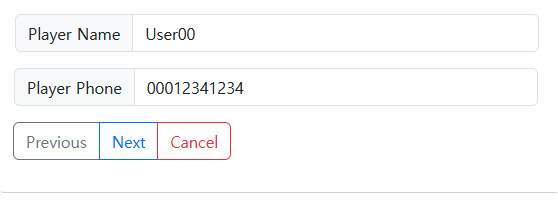

## 레시피 3-10 마법사 폼 컨트롤러로 다중 페이지 폼 처리하기

> 예전에 어드민 페이지를 구성할 때, 탭으로 순차적으로 다음으로 넘어가는 페이지를 구현했었는데... 꽤 힘들었었다.
>
> 이번 예제가 그련 류의 Wizard... 폼 타입의 페이지이다. 👍

### 이번 레시피에서 확인해야할  내용

* ...

  

## 진행

이번에는 문서 정리보다는 코드에다가 중요하거나 알게된 내용을 적었는데... 여러 단위의 폼처리를 할 때.. 세션에다 모델을 담아둔채로 단계적으로 채워나가다가 완료되면 폼 제출하고 세션의 내용은 클리어하는 방법에 대해 알게됨.

폼을 여러단계로 나누는 방법에 대해서도 잘 배웠다. 👍

꽤 그럴듯하다.. 나는 예전에 어드민 만들때는 탭마다 DB에 저장을 해버렸던 것 같은데...

### 첫번째 폼: 코트 이름 입력

### 두번째 폼:  예약 일자/시간 입력

### 세번째 폼: 플레이어 정보 입력

이후 Next는 성공화면...

## 의견

* 딱히 없음 😅

## 기타

* ...
