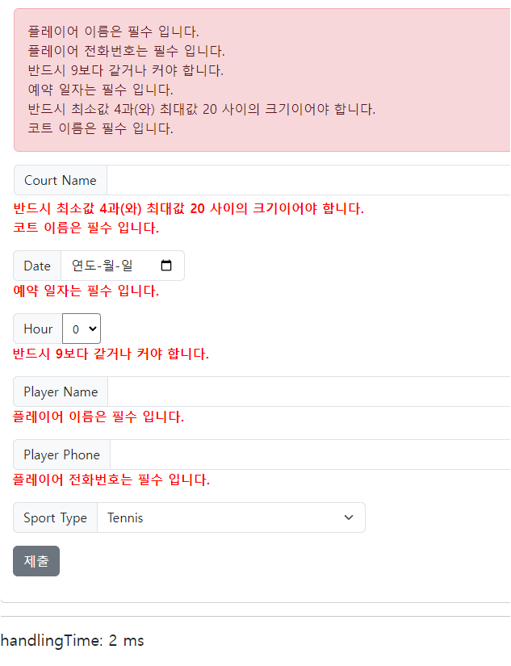

## 레시피 3-11 표준 애너테이션(JSR-303)으로 빈 검증하기

> 이번 장은 그냥 Reservation 도메인 클래스의 검증을 별도 검증기를 통해서 하지 않고,
>
> 표준 애너테이션으로 검사하게 바꾸기만 하면 되겠다. 👍
>
> 별도로 만든 Validator 코드를 제거하고  애너테이션으로만 처리되도록 하자!


### 이번 레시피에서 확인해야할  내용

* ...

  

## 진행

* JSR-303 어노테이션 사용 및 테스트를 위해 다음 라이브러리를 추가

  ```groovy
    implementation "org.hibernate.validator:hibernate-validator:${hibernateValidatorVersion}"
    testRuntimeOnly "org.glassfish:javax.el:${javaxElVersion}"
  ```

* 그런데.. 테스트 코드 상에서 동작은 별 문제 없는 것을 확인했는데... 실제 사용시 메시지 소스가 원하는대로 변환되서 안들어간다. 😂

  ```java
    @NotNull
    @NotEmpty(message = "{required.courtName}")
    @Size(min = 4, max = 20)
    private String courtName;
  ```

  위처럼 코트 이름 필드를 설정했을 때... `@NotEmpty` 에 대한 메시지 프로퍼티 설정이 안들어간다. ㅠㅠ

  ---

  사용자 정의 검증 오류 메시지 나오지 않는 문제 해결 했음...

  ```java
  @EnableWebMvc
  @Configuration
  public class I18NConfiguration implements WebMvcConfigurer {
    // ...
    @Bean
    MessageSource messageSource() {
      ReloadableResourceBundleMessageSource messageSource =
          new ReloadableResourceBundleMessageSource();
      messageSource.setBasename("classpath:messages");
      messageSource.setDefaultEncoding(StandardCharsets.UTF_8.name());
      return messageSource;
    }
    
    
    // ✨: WebMvcConfigurer의 getValidator()를 Override 하는게 핵심이였다.
    @Override
    @Bean
    public LocalValidatorFactoryBean getValidator()() {
      LocalValidatorFactoryBean validatorFactoryBean = new LocalValidatorFactoryBean();
      validatorFactoryBean.setValidationMessageSource(messageSource());
      return validatorFactoryBean;
    }
  }
  ```

  > WebMvcConfigurerAdapter를 이미 확장한 경우 사용자 정의 Validator 가 무시되는 것을 방지하려면 부모 클래스에서 getValidator() 메서드를 재정의하여 Validator 를 설정해야 한다고 함.

* JSR-303 검증 오류 메시지 확인

  

  


## 의견

* ...


## 기타

* ...
