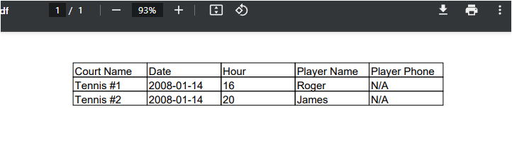
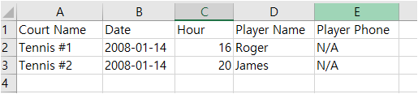

## 레시피 3-12 엑셀 및 PDF 뷰 생성하기

> ...
>

### 이번 레시피에서 확인해야할  내용

* ...

  

## 진행

이번 예제 진행이 좀 힘들었다.

가장 힘들었던 부분만 말하자면...

* 😈 contentNegotiatingViewResolver가 확장자에 따라서 PDF 리졸버, Excel 리졸버 선택을 제대로 못한다 무조건 html로만 처리됨. 😈

그래서 결국은 ...

5.3부터 Depreacted 경고 나와서 없애고 싶었던 `ResourceBundleViewResolver`을 `BeanNameViewResolver`를 사용하는 방식으로 바꾸고 그거에 맞춰서 컨트롤러 코드도 바꿨다.

```java
  @GetMapping("/reservationSummary{ext}")
  public String generateSummary(
      @RequestParam(value = "date") @DateTimeFormat(pattern = "yyyy-MM-dd") LocalDate selectedDate,
      @PathVariable("ext") String ext,
      Model model) {

    List<Reservation> reservations = reservationService.findByDate(selectedDate);

    model.addAttribute("reservations", reservations);
    if (".pdf".equals(ext)) {
      return "pdfReservationSummary";
    } else if (".xlsx".equals(ext)) {
      return "excelReservationSummary";
    } else if ("".equals(ext)) {
      return "reservationSummary";
    } else {
      throw new NotSupportExtensionException(ext);
    }
  }
```

컨트롤러 메서드에서 결정해서 빈으로 미리 설정한 각 View를 분기하게 처리했음.

그러고 나니 원활하게 잘 처리됨.

#### PDF



#### XLSX




## 의견

* 이제 3장 스프링 MVC를 다봤다. 짜증이나서 잠깐 그만뒀었는데.. 지식이 쌓이고 다시보니까. 결국 다 보게된 것 같다. 👍


## 기타

### 0. itextpdf 최신 버전 쓰려면 AbstractPdfView를 좀 바꿔서 사용해야함.

* https://github.com/spring-projects/spring-framework/blob/5.3.x/spring-webmvc/src/main/java/org/springframework/web/servlet/view/document/AbstractPdfView.java
  * Spring 저장소 Tags를 최신 master 로 바꿔도 최신 버전은 반영이 안되어있음.

CustomAbstractPdfView를 만들어서, 최신 itextpdf를 사용할 수 있게 바꿨다.

* 2023년 9월 19일 기준 최신 버전: `5.5.13.3`


### 1. AbstractXlsxView를 사용하면 xlsx 반환이므로, `poi-ooxml` 도 필요함.

```groovy
  implementation "org.apache.poi:poi:${apachePoiVersion}"
  implementation "org.apache.poi:poi-ooxml:${apachePoiVersion}" // xlsx로 사용하려면 이 라이브러리가 필요하다.
```


## 정오표

* 240쪽 첫번째 줄: 
  * 엑셀파일을 생성하려면 > PDF파일을 생성하려면
