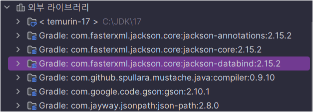

## 레시피 4-02-iv REST 서비스로 JSON 발행하기 

> ...
>

### 이번 레시피에서 확인해야할  내용

* 저자님 iv 예제를 봤을 때... `Gson`이 사용되었어야 했을 것 같은데... 사용된 부분이 없다.. 그냥 내가 만들자~

  

## 진행

* 디펜던시에 Gson을 넣고 컨버터를 확인 해봤을 때... 다음과 같았다.

  ```
   ### converters: [
     org.springframework.http.converter.ByteArrayHttpMessageConverter@55aa7cc0, 
     org.springframework.http.converter.StringHttpMessageConverter@6111aa49,
     org.springframework.http.converter.ResourceHttpMessageConverter@79aac496,
     org.springframework.http.converter.ResourceRegionHttpMessageConverter@5a6e1f51,
     org.springframework.http.converter.xml.SourceHttpMessageConverter@5c2424a0,
     org.springframework.http.converter.support.AllEncompassingFormHttpMessageConverter@308b8e8f,
     org.springframework.http.converter.xml.Jaxb2RootElementHttpMessageConverter@1faa627c,
     org.springframework.http.converter.json.MappingJackson2HttpMessageConverter@3514624f] 
   ###
  ```

  라이브러리 디펜던시 보고 추가되는 줄알았더니 그건 아니였나?

  외부 라이브러리 목록을 확인 해봤을 때.. Jackson Databind가 있음.. 왜 있지?

  

### `gradle dependencies --configuration compileClasspath`  명령 수행

```
compileClasspath - Compile classpath for source set 'main'.
+--- javax.servlet:javax.servlet-api:4.0.1
+--- org.apache.logging.log4j:log4j-core:2.20.0
|    \--- org.apache.logging.log4j:log4j-api:2.20.0
+--- org.apache.logging.log4j:log4j-slf4j2-impl:2.20.0
|    +--- org.apache.logging.log4j:log4j-api:2.20.0
|    \--- org.slf4j:slf4j-api:2.0.6 -> 2.0.7
+--- org.springframework:spring-context:5.3.30
|    +--- org.springframework:spring-aop:5.3.30
|    |    +--- org.springframework:spring-beans:5.3.30
|    |    |    \--- org.springframework:spring-core:5.3.30
|    |    |         \--- org.springframework:spring-jcl:5.3.30
|    |    \--- org.springframework:spring-core:5.3.30 (*)
|    +--- org.springframework:spring-beans:5.3.30 (*)
|    +--- org.springframework:spring-core:5.3.30 (*)
|    \--- org.springframework:spring-expression:5.3.30
|         \--- org.springframework:spring-core:5.3.30 (*)
+--- org.springframework:spring-webmvc:5.3.30
|    +--- org.springframework:spring-aop:5.3.30 (*)
|    +--- org.springframework:spring-beans:5.3.30 (*)
|    +--- org.springframework:spring-context:5.3.30 (*)
|    +--- org.springframework:spring-core:5.3.30 (*)
|    +--- org.springframework:spring-expression:5.3.30 (*)
|    \--- org.springframework:spring-web:5.3.30
|         +--- org.springframework:spring-beans:5.3.30 (*)
|         \--- org.springframework:spring-core:5.3.30 (*)
+--- javax.annotation:javax.annotation-api:1.3.2
+--- org.springframework:spring-oxm:5.3.30
|    +--- org.springframework:spring-beans:5.3.30 (*)
|    \--- org.springframework:spring-core:5.3.30 (*)
+--- javax.xml.bind:jaxb-api:2.3.1
|    \--- javax.activation:javax.activation-api:1.2.0
+--- org.glassfish.jaxb:jaxb-runtime:2.3.1
|    +--- javax.xml.bind:jaxb-api:2.3.1 (*)
|    +--- org.glassfish.jaxb:txw2:2.3.1
|    +--- com.sun.istack:istack-commons-runtime:3.0.7
|    +--- org.jvnet.staxex:stax-ex:1.8
|    +--- com.sun.xml.fastinfoset:FastInfoset:1.2.15
|    \--- javax.activation:javax.activation-api:1.2.0
+--- com.google.code.gson:gson:2.10.1
+--- org.webjars:webjars-locator:0.47
|    +--- org.webjars:webjars-locator-core:0.53
|    |    +--- org.slf4j:slf4j-api:2.0.7
|    |    +--- io.github.classgraph:classgraph:4.8.149
|    |    \--- com.fasterxml.jackson.core:jackson-core:2.15.2
|    |         \--- com.fasterxml.jackson:jackson-bom:2.15.2
|    |              +--- com.fasterxml.jackson.core:jackson-annotations:2.15.2 (c)
|    |              +--- com.fasterxml.jackson.core:jackson-core:2.15.2 (c)
|    |              \--- com.fasterxml.jackson.core:jackson-databind:2.15.2 (c)
|    +--- com.fasterxml.jackson.core:jackson-databind:2.15.2
|    |    +--- com.fasterxml.jackson.core:jackson-annotations:2.15.2
|    |    |    \--- com.fasterxml.jackson:jackson-bom:2.15.2 (*)
|    |    +--- com.fasterxml.jackson.core:jackson-core:2.15.2 (*)
|    |    \--- com.fasterxml.jackson:jackson-bom:2.15.2 (*)
|    +--- org.apache.commons:commons-text:1.10.0
|    |    \--- org.apache.commons:commons-lang3:3.12.0
|    \--- com.github.spullara.mustache.java:compiler:0.9.10
+--- org.webjars:bootstrap:5.3.2
+--- com.jayway.jsonpath:json-path:2.8.0
\--- org.projectlombok:lombok:1.18.28

```

* [Maven Repository: org.webjars » webjars-locator » 0.47 (mvnrepository.com)](https://mvnrepository.com/artifact/org.webjars/webjars-locator/0.47)

  * webjars-locator가 jackson을 들고 오는거였다. 😅
  * 이 디펜던시를 임시로 제거하고 서버를 실행해보면...

  ```
   ### converters: [
     org.springframework.http.converter.ByteArrayHttpMessageConverter@6b6eaa73,
     org.springframework.http.converter.StringHttpMessageConverter@72416c9a,
     org.springframework.http.converter.ResourceHttpMessageConverter@6581cc72,
     org.springframework.http.converter.ResourceRegionHttpMessageConverter@4021732,
     org.springframework.http.converter.xml.SourceHttpMessageConverter@1aa118f3,
     org.springframework.http.converter.support.AllEncompassingFormHttpMessageConverter@637d9281,
     org.springframework.http.converter.xml.Jaxb2RootElementHttpMessageConverter@87420c0,
     org.springframework.http.converter.json.GsonHttpMessageConverter@1cdb0d7b] 
  ###
  ```

  자동으로 GsonHttpMessageConverter으로 등록이 된 것이 보인다.

그래서 원래 MappingJackson2HttpMessageConverter 가 설정된 위치에 GsonHttpMessageConverter를 넣어주고 싶어서 다음과 같이도 해보았음.

```java
  @Override
  public void extendMessageConverters(List<HttpMessageConverter<?>> converters) {
    LOGGER.info("### AutoSetting Converters: {} ###", converters);

    for (int i = 0; i < converters.size(); i++) {
      HttpMessageConverter<?> converter = converters.get(i);

      if (converter.getClass() == MappingJackson2HttpMessageConverter.class) {
        converters.remove(i);
        converters.add(i, new GsonHttpMessageConverter());
        break;
      }
    }

    LOGGER.info("### Modified Converters: {} ###", converters);
  }
```

원래 자리가 관계없으면...

```java
  @Override
  public void extendMessageConverters(List<HttpMessageConverter<?>> converters) {
    LOGGER.info("### AutoSetting Converters: {} ###", converters);

    converters.removeIf(c -> c instanceof MappingJackson2HttpMessageConverter);
    converters.add(0, gsonHttpMessageConverter());

    LOGGER.info("### Modified Converters: {} ###", converters);
  }
  
  // pretty print 설정 포함된 메시지 컨버터
  private GsonHttpMessageConverter gsonHttpMessageConverter() {
    Gson gson = new GsonBuilder().setPrettyPrinting().create();
    return new GsonHttpMessageConverter(gson);
  }
```

이렇게 하는 것도 나쁘지 않을 것 같다.

프로젝트에서 GSON을 주로 핵심적으로 사용한다면 인덱스 번호를 0으로 줘서 맨앞에둬도 괜찮을 것 같긴함..


## 의견

* ...


## 기타

* ...


## 정오표

* p261의 members.json의 결과

  ```json
  // model.addAttribute("members", members); 에다 설정을 해서 JsonView로 반환을 했다면 
  // 아래 내용으로 출력이 되야하는게 맞긴하지만...
  {
    "members" : {
      "members" : [ {
        "name" : "Marten Deinum",
        "phone" : "00-31-1234567890",
        "email" : "marten@deinum.biz"
      }, {
        "name" : "John Doe",
        "phone" : "1-800-800-800",
        "email" : "john@doe.com"
      }, {
        "name" : "Jane Doe",
        "phone" : "1-801-802-803",
        "email" : "jane@doe.com"
      } ]
    }
  }
  ```

  ```json
  // 261쪽에서는 @ResponseBody로 Members를 바로 반환했기 때문에 members가 한번만 감싸는 형태로 나타나야함.
  {
    "members": [
      {
        "name": "Marten Deinum",
        "phone": "00-31-1234567890",
        "email": "marten@deinum.biz"
      },
      {
        "name": "John Doe",
        "phone": "1-800-800-800",
        "email": "john@doe.com"
      },
      {
        "name": "Jane Doe",
        "phone": "1-801-802-803",
        "email": "jane@doe.com"
      }
    ]
  }
  ```

  

