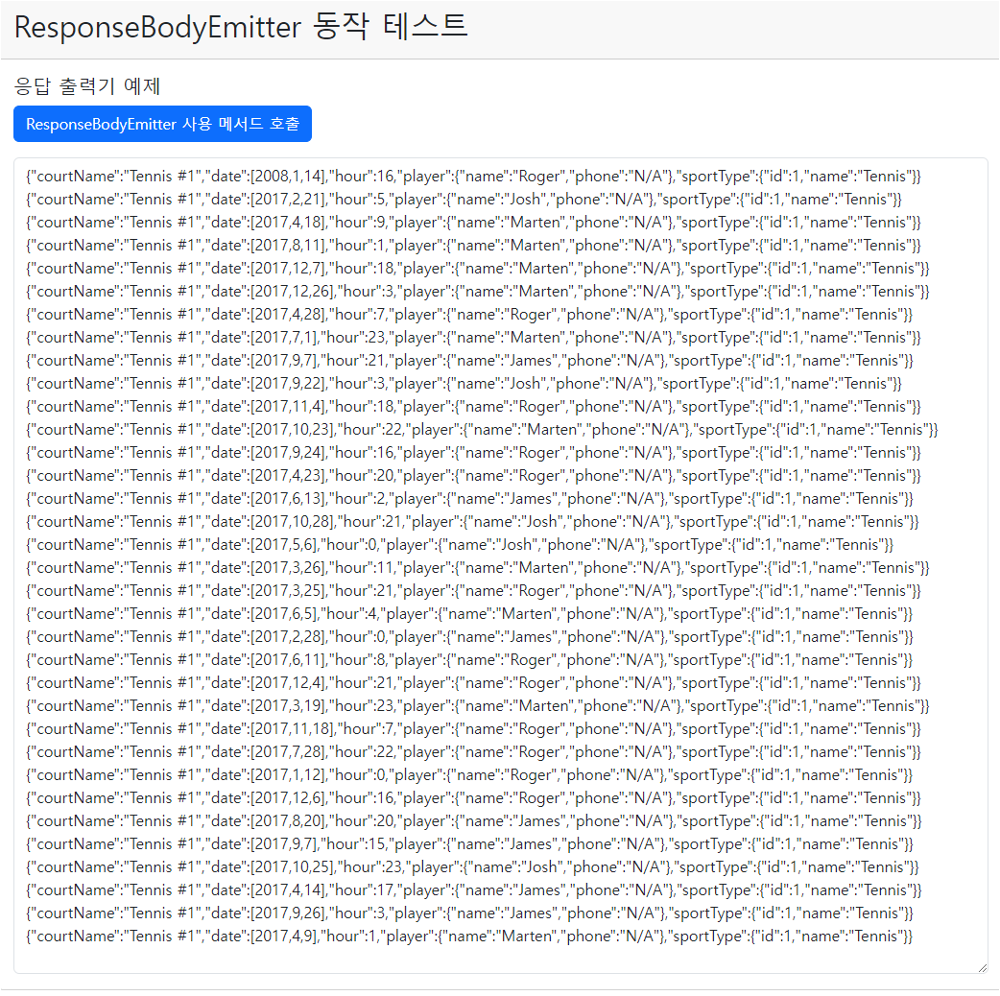

## 레시피 5-02-i 응답 출력기

> ...
>

### 이번 레시피에서 확인해야할  내용

* 서비스에서 응답을 여러 청크<sup>chunk</sup>(덩이)로 나누어 전송

  
  
  

## 진행

책에서는 curl로 확인을 하던데...

ajax로 스트리밍을 받아서 화면에 직접 출력하는 식으로 고쳐보자!


### 1. 청크단위를 JSON으로 반환하므로 메시지 컨버터를 제대로 설정할 팔요가 있었음.

Reservation이 LocalDate를 포함하고 있으므로... `jackson-datatype-jsr310`을 추가해야함.

```groovy
  implementation "com.fasterxml.jackson.core:jackson-databind:${jacksonDatabindVersion}"
  implementation "com.fasterxml.jackson.datatype:jackson-datatype-jsr310:${jacksonVersion}"
```

Mvc 설정 클래스에서 스프링이 자동으로 설정한 Jackson 메시지 컨버터는 제거하고 JSR310 모듈 설정을 넣어서 새로 설정.

```java
  @Override
  public void extendMessageConverters(List<HttpMessageConverter<?>> converters) {
    converters.removeIf(c -> c.getClass() == MappingJackson2HttpMessageConverter.class);
    converters.add(
        0,
        new MappingJackson2HttpMessageConverter(
            Jackson2ObjectMapperBuilder.json().modules(new JavaTimeModule()).build()));
  }
```


### 2. curl 호출

`@GetMapping(params = "courtName")` 가 붙어있으므로 curl 호출에 courtName을 붙여서 호출하면 되는데...  윈도우에 기본 내장된 CURL로 하면 잘 안된다. 😅

WSL의 Ubuntu에 포함된 curl로는 잘되는 것을 확인했다. 파라미터 값이 공백과 #이 들어가서 `--data-urlencode`  이 옵션을 붙여줘야함.

```bash
curl -G http://win-localhost:8080/reservationQuery --data-urlencode  courtName='Tennis #1'
```

실행 결과는 다음과 같은데..

```json
{"courtName":"Tennis #1","date":[2008,1,14],"hour":16,"player":{"name":"Roger","phone":"N/A"},"sportType":{"id":1,"name":"Tennis"}}{"courtName":"Tennis #1","date":[2017,12,15],"hour":12,"player":{"name":"Roger","phone":"N/A"},"sportType":{"id":1,"name":"Tennis"}}{"courtName":"Tennis #1","date":[2017,8,4],"hour":14,"player":{"name":"Roger","phone":"N/A"},"sportType":{"id":1,"name":"Tennis"}}{"courtName":"Tennis #1","date":[2017,12,23],"hour":21,"player":{"name":"James","phone":"N/A"},"sportType":{"id":1,"name":"Tennis"}}{"courtName":"Tennis #1","date":[2017,12,17],"hour":18,"player":{"name":"James","phone":"N/A"},"sportType":{"id":1,"name":"Tennis"}}{"courtName":"Tennis #1","date":[2017,8,28],"hour":2,"player":{"name":"Josh","phone":"N/A"},"sportType":{"id":1,"name":"Tennis"}}{"courtName":"Tennis #1","date":[2017,8,20],"hour":22,"player":{"name":"Josh","phone":"N/A"},"sportType":{"id":1,"name":"Tennis"}}{"courtName":"Tennis #1","date":[2017,8,11],"hour":23,"player":{"name":"James","phone":"N/A"},"sportType":{"id":1,"name":"Tennis"}}{"courtName":"Tennis #1","date":[2017,5,19],"hour":14,"player":{"name":"James","phone":"N/A"},"sportType":{"id":1,"name":"Tennis"}}{"courtName":"Tennis #1","date":[2017,3,2],"hour":2,"player":{"name":"Roger","phone":"N/A"},"sportType":{"id":1,"name":"Tennis"}}{"courtName":"Tennis #1","date":[2017,5,5],"hour":6,"player":{"name":"Marten","phone":"N/A"},"sportType":{"id":1,"name":"Tennis"}}{"courtName":"Tennis #1","date":[2017,1,23],"hour":11,"player":{"name":"Roger","phone":"N/A"},"sportType":{"id":1,"name":"Tennis"}}{"courtName":"Tennis #1","date":[2017,3,18],"hour":18,"player":{"name":"James","phone":"N/A"},"sportType":{"id":1,"name":"Tennis"}}{"courtName":"Tennis #1","date":[2017,2,11],"hour":3,"player":{"name":"Marten","phone":"N/A"},"sportType":{"id":1,"name":"Tennis"}}{"courtName":"Tennis #1","date":[2017,8,27],"hour":12,"player":{"name":"Josh","phone":"N/A"},"sportType":{"id":1,"name":"Tennis"}}{"courtName":"Tennis #1","date":[2017,3,24],"hour":11,"player":{"name":"Marten","phone":"N/A"},"sportType":{"id":1,"name":"Tennis"}}{"courtName":"Tennis #1","date":[2017,12,21],"hour":7,"player":{"name":"James","phone":"N/A"},"sportType":{"id":1,"name":"Tennis"}}{"courtName":"Tennis #1","date":[2017,5,14],"hour":17,"player":{"name":"James","phone":"N/A"},"sportType":{"id":1,"name":"Tennis"}}{"courtName":"Tennis #1","date":[2017,7,20],"hour":4,"player":{"name":"James","phone":"N/A"},"sportType":{"id":1,"name":"Tennis"}}{"courtName":"Tennis #1","date":[2017,8,9],"hour":9,"player":{"name":"Roger","phone":"N/A"},"sportType":{"id":1,"name":"Tennis"}}{"courtName":"Tennis #1","date":[2017,3,22],"hour":12,"player":{"name":"Marten","phone":"N/A"},"sportType":{"id":1,"name":"Tennis"}}{"courtName":"Tennis #1","date":[2017,8,13],"hour":6,"player":{"name":"Marten","phone":"N/A"},"sportType":{"id":1,"name":"Tennis"}}{"courtName":"Tennis #1","date":[2017,9,18],"hour":13,"player":{"name":"Marten","phone":"N/A"},"sportType":{"id":1,"name":"Tennis"}}{"courtName":"Tennis #1","date":[2017,1,22],"hour":3,"player":{"name":"Marten","phone":"N/A"},"sportType":{"id":1,"name":"Tennis"}}{"courtName":"Tennis #1","date":[2017,8,27],"hour":17,"player":{"name":"Roger","phone":"N/A"},"sportType":{"id":1,"name":"Tennis"}}{"courtName":"Tennis #1","date":[2017,7,4],"hour":11,"player":{"name":"Marten","phone":"N/A"},"sportType":{"id":1,"name":"Tennis"}}{"courtName":"Tennis #1","date":[2017,6,5],"hour":7,"player":{"name":"Roger","phone":"N/A"},"sportType":{"id":1,"name":"Tennis"}}{"courtName":"Tennis #1","date":[2017,9,25],"hour":1,"player":{"name":"Josh","phone":"N/A"},"sportType":{"id":1,"name":"Tennis"}}

```

결국 Reservation 도메인을 하나씩 JSON으로 보내는 것이였다.

```json
{
	"courtName": "Tennis #1",
	"date": [
		2008,
		1,
		14
	],
	"hour": 16,
	"player": {
		"name": "Roger",
		"phone": "N/A"
	},
	"sportType": {
		"id": 1,
		"name": "Tennis"
	}
}
```

* 최소단위를 완전한 JSON 단위로 맞춰서 보내는게 클라이언트에서 해석하기 쉬울 것 같음.


### 그냥 끝내는 건 재미없으니, 백단 코드에서 보내기 전에 지연시간을 두고, 클래이언트 뷰에서 Ajax로 호출해보자. (그런데 현 상태로는 불가능할 듯.. 😂)

* 그런데 해보려고 했는데... 지연시간을 넣어서 curl호출해봤을 때.. 반드시 JSON모양 맞춰서 데이터까 끝어지지 않는다. 
  * 일정 크기 버퍼에 쌓고 버퍼 차면 한번에 flush 하는 느낌이듬..

* 그리고 지연시간 총합이 . mvc 설정 클래스에서 지정한 시간 초과될 경우 에러 던진다.

  ```java
    @Override
    public void configureAsyncSupport(AsyncSupportConfigurer configurer) {
      configurer.setDefaultTimeout(TimeUnit.MILLISECONDS.convert(5, TimeUnit.SECONDS));
      configurer.setTaskExecutor(mvcTaskExecutor());
    }
  ```

  - [x] 그러면 응답의 JSON 파싱은 하지말고 넘어오는 데이터를 `<textarea>`에 뿌리는 식으로 해보자!


### 💡 불가능 할 줄 알았는데, 응답이 읽기 스트림이면 fatch에서 Reader를  얻어서 실시간으로 읽을 수 있음.

* 빙과 https://stackoverflow.com/a/62123585 답변 참고

```javascript

   fetch("/reservationQuery?courtName=" + encodeURIComponent("Tennis #1"), {
      method: 'GET'
    })
    .then(response => readAllChunks(response.body))
    .catch(error => {
      console.error('Error:', error);
    });

    // https://stackoverflow.com/a/62123585 답변 참고
    async function readAllChunks(readableStream) {
      const reader = readableStream.getReader();
      const decoder = new TextDecoder();

      let done, value;
      while (!done) {
        ({value, done} = await reader.read());
        if (done) {
          spinner.classList.add('d-none');
          button.disabled = false;
        }
        resultArea.textContent += decoder.decode(value);
      }
    }
```



* 호출 버튼 누르면 지연 시간 설정한 대로 Reservation JSON 청크 단위로 받아오는 것을 볼 수 있었다.


## 의견

* ...

  

## 기타

### 레시피 5-02-ii 예제 내용 포함

* ResponseBodyEmitter를 ResponseEntity로 감싸서 사용자 정의 헤더, 상태코드 포함해서 반환한 내용


## 정오표

* ...

