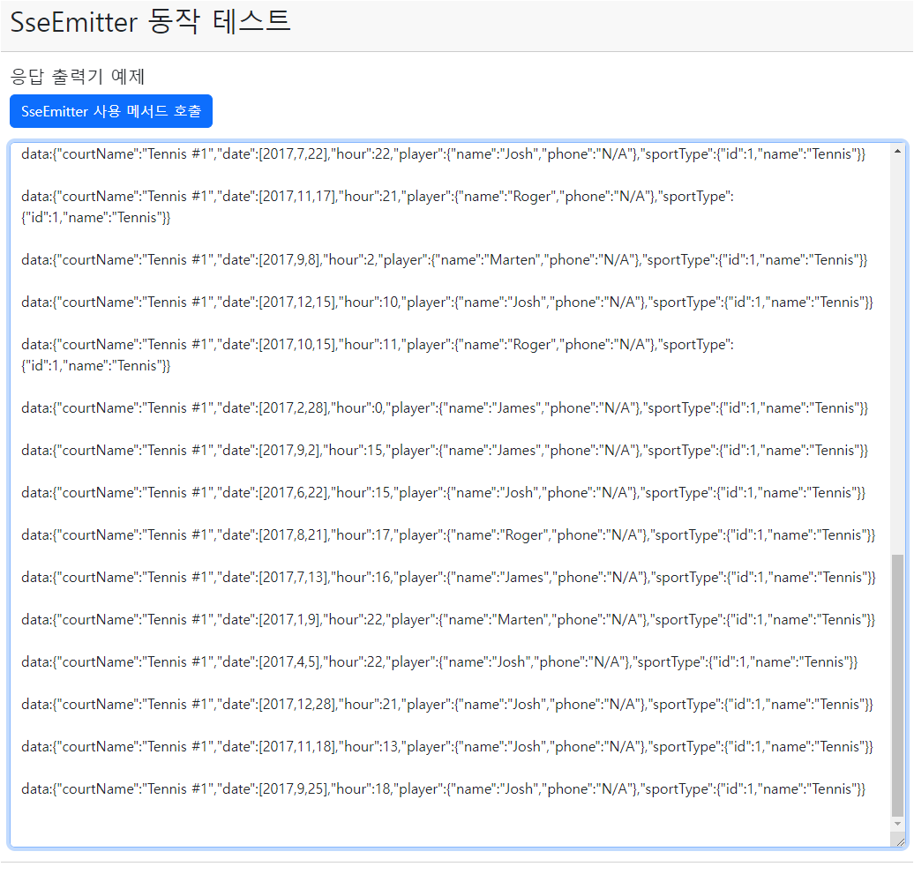
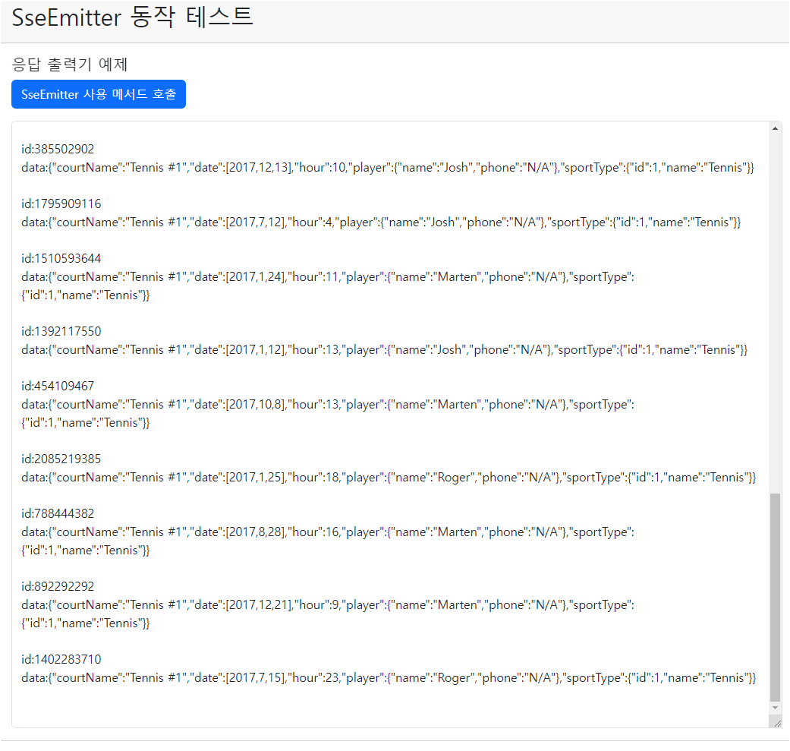

## 레시피 5-02-iii 응답 출력기 - 여러 결과를 이벤트 형태로 보내기

> 💡 5-02-i와 별차이는 없은데, `SseEmitter` 특성을 알아야하니, 예제 프로젝트를 분리했다.

### 이번 레시피에서 확인해야할  내용

* 여러 결과를 이벤트 형태로 보내기 - `SseEmitter` 사용

  
  
  

## 진행

* SseEmitter로 바꿔봤을 때.. 청크의 끝에 개행을 추가해서 보내는 부분이 보인다.

  

* NDJSON (Newline Delimited JSON) 포멧이 되는 것 같다.

  * 각 데이터의 마지막 줄이 개행으로 끝남 (개행앞에 캐리지 리턴(`\r`)이 올수도 있음.)

    

* Curl로 호출 했을 때도 각 단일 데이터 끝에 개행이 추가되는 모습이 보였다

  ```
  $ curl -v -G http://win-localhost:8080/reservationQuery --data-urlencode courtName='Tennis #1'
  *   Trying xxx.xxx.xxx.xxx:8080...
  * Connected to win-localhost (xxx.xxx.xxx.xxx) port 8080 (#0)
  > GET /reservationQuery?courtName=Tennis+%231 HTTP/1.1
  > Host: win-localhost:8080
  > User-Agent: curl/7.81.0
  > Accept: */*
  >
  * Mark bundle as not supporting multiuse
  < HTTP/1.1 200
  < Content-Type: text/event-stream
  < Transfer-Encoding: chunked
  < Date: Sun, 24 Sep 2023 20:38:30 GMT
  <
  data:{"courtName":"Tennis #1","date":[2008,1,14],"hour":16,"player":{"name":"Roger","phone":"N/A"},"sportType":{"id":1,"name":"Tennis"}}
  
  data:{"courtName":"Tennis #1","date":[2017,1,19],"hour":13,"player":{"name":"James","phone":"N/A"},"sportType":{"id":1,"name":"Tennis"}}
  
  ... 중략 ...
  
  data:{"courtName":"Tennis #1","date":[2017,12,28],"hour":21,"player":{"name":"Josh","phone":"N/A"},"sportType":{"id":1,"name":"Tennis"}}
  
  data:{"courtName":"Tennis #1","date":[2017,11,18],"hour":13,"player":{"name":"Josh","phone":"N/A"},"sportType":{"id":1,"name":"Tennis"}}
  
  data:{"courtName":"Tennis #1","date":[2017,9,25],"hour":18,"player":{"name":"Josh","phone":"N/A"},"sportType":{"id":1,"name":"Tennis"}}
  
  * Connection #0 to host win-localhost left intact
  $
  ```

  * 응답 헤더의 Content-Type:  `text/event-stream`

  

## 의견

* ...

  

## 기타

윈도우에 포함된 CURL을 사용할 때..

```sh
curl -v -G http://localhost:8080/reservationQuery --data-urlencode courtName="Tennis #1"
```

* 특수 문자가 들어간 데이터 부분을 따옴표 (`'`) 가 아닌 쌍따옴표(`"`)으로 묶어야 한다.
* CMD에서 동작하는 것을 확인함.


### 레시피 5-02-iv 예제 포함

p293쪽에 SseEmitter의 이벤트에 더 많은 정보를 추가하려면.. 아래처럼 해야했다.

```java
emitter.send(SseEmitter.event().id(String.valueOf(reservation.hashCode())).data(reservation));
```



id와 데이터로 나뉜것이 보인다.


## 정오표

* ...

