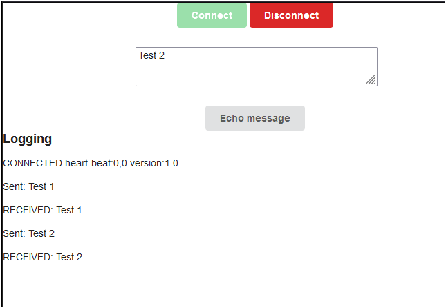

## 레시피 5-04-ii 웹소켓 - STOMP와 MessageMapping

> ...
> 

### 이번 레시피에서 확인해야할  내용

* STOMP와 MessageMapping

  

## 진행

#### 추가 디펜던시

```groovy
implementation "org.springframework:spring-messaging:${springVersion}"
```


* 브라우저를 여러개 띄어놓고 메시지를 넣어보면 다른 브라우저에서도 RECEIVED 부분은 동일하게 받아지는 것을 볼 수 있음.




### 💡 AbstractWebSocketMessageBrokerConfigurer는 Spring 5.0부터 Deprecated 됨

다른 MVC 설정 클래스와 마찬가지로 WebSocketMessageBrokerConfigurer 를 구현해서 사용하면된다.

기본 기능들은 인터페이스에 default 메서드로 구현이 되어있음.


## 의견

* ...


## 기타

#### webstomp-client 같은 라이브러리?

[webstomp-client](https://github.com/JSteunou/webstomp-client)는 개발이 중단 된 것 같다. 레파지토리가 2018년 중에 보관 상태로 바뀜.

* stompjs
  * [GitHub - stomp-js/stompjs: Javascript and Typescript Stomp client for Web browsers and node.js apps](https://github.com/stomp-js/stompjs)

- [ ] 처음에는 `webstomp-client` 으로 해보고, 이후에 `stompjs`로 바꿔보자!

이것도 webjars로 사용할 수 있음.

* build.gradle

  ```groovy
  implementation "org.webjars.npm:webstomp-client:${webstompClientVersion}"
  ```

* html 사용처

  ```html
  <script type="text/javascript" src="webjars/webstomp-client/dist/webstomp.min.js"></script>
  ```

  

### 메시징 시스템에서의 토픽?

> 메시징에서 토픽이란 메시지를 분류하고 구독하는 데 사용되는 이름입니다. 예를 들어, 스포츠 관련 메시지를 보내거나 받으려면 'sports’라는 토픽을 사용할 수 있습니다. 토픽은 여러 발행자와 구독자가 메시지를 공유할 수 있도록 합니다. 토픽은 일반적으로 계층적이고 점으로 구분된 문자열로 구성됩니다. 예를 들어, 'sports.baseball’이나 'sports.soccer’와 같은 토픽을 사용할 수 있습니다.


### 테스트

#### 💡 TODO: 테스트 방법은 아직은 잘 모르겠음. 이건 챕터를 끝내고 천천히 해보자!

* https://github.com/rstoyanchev/spring-websocket-portfolio/tree/main/src/test


## 정오표

* ...

  


---

## JavaDocs

* ...
