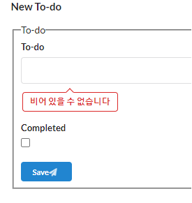

## 7장 스프링 시큐리티에 들어가기에 앞서...

> ...
> 

### 이번 레시피에서 확인해야할  내용

* 인증 처리가 안된 Todo 어플리케이션에 대해 확인.

  

## 진행

인증 처리가 안되어있어 접근 통제가 되지 않는 Todo 어플리케이션 작성

스프링 시큐리티와는 관계 없지만..

- [x] JSP를 Thymeleaf로 바꿔보자!

- [x] 컨트롤러 테스트 코드 작성.

  


## 의견

#### HiddenHttpMethodFilter는 왜쓸까 했더니..?

* Form 제출을 할 때, _method Hidden 폼으로 GET, POST 이외의 요청을 하기 위해서 추가 필터 설정
  * 예제가 Todo 완료 처리 (PUT), Todo 삭제처리 (DELETE) 로 되어있는데, form전송을 하고 있음.
  * Ajax 요청만을 쓰면 이 필터가 필요가 없을 텐데, HTML Form은 GET/POST만 지원해서 이런 필터를 사용하신 것 같다.


### Thymeleaf로 전환하고 나서 한글 출력, 입력이 안됨?

```java
  @Bean
  ThymeleafViewResolver thymeleafViewResolver() {
    final ThymeleafViewResolver viewResolver = new ThymeleafViewResolver();
    viewResolver.setTemplateEngine(thymeleafTemplateEngine());
    // ✨ 아래 인코딩 설정이 필수였다. 이것을 설정하지 않으면 한글 처리 자체가 안됨.
    viewResolver.setCharacterEncoding(PROJECT_ENCODING_VALUE);
    return viewResolver;
  }
```

위의 부분 인코딩 설정을 꼭 해줘야했다.


### H2에서 HSQLDB로 전환했는데.. 테이블 생성 오류가 발생한다.?

BOOLEAN 컬럼 설정할 때.. DEFAULT의 위치가 다음과 같아야함. 

```sql
CREATE TABLE todo
(
    id          BIGINT       GENERATED BY DEFAULT AS IDENTITY (START WITH 1) PRIMARY KEY,
    owner       VARCHAR(255) NOT NULL,
    description VARCHAR(255) NOT NULL,
    completed   BOOLEAN      DEFAULT FALSE NOT NULL
);
```

컬럼 타입 바로 다음에 DEFAULT 설정을 해야함.


### WebTestClient를 추가하긴 했는데.. 일반적인 MVC View 컨트롤러 테스트하는데는 한계가 있다.

일반적인 MVC View 컨트롤러 테스트에는 MockMvc를 사용하는게 낫고,

REST API 테스트 할 때는 WebTestClient가 유용할 것 같다.


###  Semantic-UI 에서 바인딩 오류 메시지를 이쁘게 나타내고 싶다!! 🎃

저자님께서 Semantic-UI를 사용하셨길레 그대로 쓰고 있는데.. 오류 메시지를 깔끔하게 나타내고 싶어서 찾아서 적용해보았다.

* https://semantic-ui.com/elements/label.html

  ```html
        <div class="field">
          <label>To-do</label>
          <input th:field="*{description}">
          <div class="ui pointing red basic label" th:if="${#fields.hasErrors('description')}" th:errors="*{description}"></div>
        </div>
  ```

  Thymeleaf 코드가 섞여있긴 한데. 위처럼 하면 됨. 👍

  


---

## 기타

- ...


## 정오표

* ...

  


---

## JavaDocs

* ...
