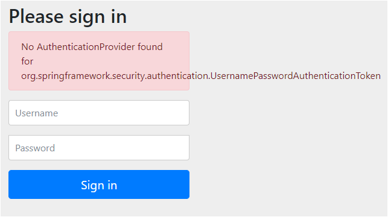

## 레시피 7-01-ii URL 접근 보안하기 - 완전하지 않은 기본 폼 로그인 인증 설정

> ...
> 

### 이번 레시피에서 확인해야할  내용

* 스프링 시큐리티 설정을 적용해본다.

  * 전체 URL에 대해 인증을 요구한다.
  
  * 🎃 그러나 다른 설정이 없어서 로그인 페이지가 출력되지만, 인증 제공자 설정이 하나도 없어서 로그인을 할 수 없다.
  
    
  
    
  
  

## 진행

* ...


## 의견

#### p386 Note에서 `AbstractAnnotationConfigDispatcherServletInitializer`를 상속한 클래스가 있으면 여기에 보안 설정 클래스를 추가해야 시동중 예외가 발생한다고 하였는데, 다음과 같은 상태에서 실행중 예외는 발생하지 않는다.

```java
// AbstractAnnotationConfigDispatcherServletInitializer를 상속한 TodoWebInitializer 가 프로젝트에 있음
public class TodoWebInitializer extends AbstractAnnotationConfigDispatcherServletInitializer {
  //...
  @Override
  protected Class<?>[] getServletConfigClasses() {
    return new Class<?>[]{TodoWebConfig.class};
  }
  //...
}


// 아래 클래스를 동시에 구성해도 실행중 오류는 발생하지 않는다.
public class TodoSecurityInitializer extends AbstractSecurityWebApplicationInitializer {
  public TodoSecurityInitializer() {
    super(TodoSecurityConfig.class);
  }
}
```

😅 그런데 저자님 예제 소스도 위처럼 되어있음.


#### 시큐리티 설정 클래스에서 이제는 WebSecurityConfigurerAdapter를 상속 받을 필요가 없다.

  WebSecurityConfigurerAdapter가 지원 중단 되었고,
  아래와 같이 org.springframework.security.web.SecurityFilterChain 빈을 사용하여
  HttpSecurity를 구성하거나 WebSecurityCustomizer 빈을 사용하여 WebSecurity를 구성하라고 함.

```java
      @Bean
      public SecurityFilterChain securityFilterChain(HttpSecurity http) throws Exception {
          http
              .authorizeHttpRequests((authz) ->
                  authz.anyRequest().authenticated()
              );
              // ...
          return http.build();
      }
 
     @Bean
     public WebSecurityCustomizer webSecurityCustomizer() {
         // Spring Security 6.x에서는 아래 내용도
         // request mapping 규칙으로 다 명시하는 것 추천하는 경고를 본적이 있는 것 같다.
         return (web) -> web.ignoring().antMatchers("/resources/**");
     }
```


#### 완전이 설정이 아닌데도 스프링 시큐리티 테스트 설정을 추가해봤을 때.. 잘된다..

AuthenticationProvider가 하나도 없어서 안될 줄 알았는데.. 되긴함..😅

* Mock 로그인 유저 설정

  ```java
  @SpringJUnitWebConfig(classes = {TodoWebConfig.class, TodoSecurityConfig.class})
  @WithMockUser("user00") // ✨ mock 로그인 유저 설정, 메서드 단위로 해도 되긴함.
  class TodoControllerTests {
  ```

* MockMvc에 스플이 시큐리티 적용

  ```java
    @BeforeEach
    void setUp() {
      this.mockMvc =
          MockMvcBuilders.webAppContextSetup(context) //
              .apply(springSecurity()) // ✨ Spring Security 적용
              .build();
    }
  ```

* GET 요청이 아닌 POST, PUT, DELETE 등에는 CSRF 요청 처리 설정

  ```java
    @Transactional
    @Test
    void complete() throws Exception {
      mockMvc
          .perform(
              put("/todos/{todoId}/completed", 1) //
                  .with(csrf())) // ✨ csrf 설정
          .andDo(print())
          .andExpect(status().isFound())
          .andExpect(redirectedUrl("/todos"));
    }
  ```

  


---

## 기타

- ...


## 정오표

* p385:
  * `CSFR` -> `CSRF`


---

## JavaDocs

### AbstractSecurityWebApplicationInitializer

> 등록된 다른 필터보다 먼저 스프링 보안 필터 체인을 사용하도록 DelegatingFilterProxy를 등록합니다. AbstractSecurityWebApplicationInitializer(Class...)와 함께 사용할 경우 ContextLoaderListener도 등록합니다. 이 클래스를 AbstractSecurityWebApplicationInitializer()와 함께 사용하는 경우, 일반적으로 이 클래스는 AbstractContextLoaderInitializer의 서브클래스에 추가하여 사용됩니다.
> 기본적으로 DelegatingFilterProxy는 지원되지 않고 등록되어 있지만, isAsyncSecuritySupported() 및 getSecurityDispatcherTypes()를 재정의하여 활성화할 수 있습니다.
> springSecurityFilterChain 전후의 추가 구성은 afterSpringSecurityFilterChain(ServletContext)를 오버라이드하여 추가할 수 있습니다.
>
> **주의 사항**
> AbstractDispatcherServletInitializer의 서브클래스는 다른 어떤 필터보다 먼저 필터를 등록합니다. 즉, 일반적으로 AbstractDispatcherServletInitializer의 서브클래스가 먼저 호출되도록 하고 싶을 것입니다. 이는 AbstractDispatcherServletInitializer의 순서 또는 순서가 AbstractSecurityWebApplicationInitializer의 서브클래스보다 빠른지 확인하여 수행할 수 있습니다.
>
> 
