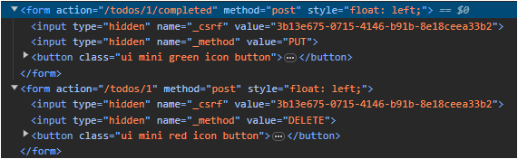

## 레시피 7-01-iii URL 접근 보안하기 - 유저 추가, URL 접근 보안 설정

> 7-01-ii와 비교해서, 로그인 유저를 추가하고 URL 접근 보안을 설정했다.
>
> * 레시피 7-01-iv내용도 포함 - CSRF 관련 내용

### 이번 레시피에서 확인해야할  내용

* ...

  


## 진행

#### Spring Security 5.8.8 에서 requestMatchers() 설정을 하면 서버 시작 예외가 발생함

* https://github.com/fp024/spring-5-recipes-study/issues/14

위 문제 때문에 예제 진행에 시간이 좀 걸렸다.  😅

일단은 Spring Security 5.8.8 환경에서 antMatcher 사용하다가 담당자 분들이 수정을 해주면 버전올려서 확인해보자..


## 의견

* ...


---

## 기타

#### 레시피 7-01-iv내용 포함 - CSRF 공격 방어

* 7-01-iii 프로젝트에서 CSRF 설정을 기본 설정으로 활성화 하고 있는 상태였기 때문에 이미 사용중이였다.

* HttpSessionCsrfTokenRepository를 수동 설정하는 예시가 있는데, 기본으로 쓰면 HttpSessionCsrfTokenRepository로 쓰는 것 같다.

  ```java
  // CsrfConfigurer 클래스 내용
  private CsrfTokenRepository csrfTokenRepository = new LazyCsrfTokenRepository(new HttpSessionCsrfTokenRepository());
  ```

* Thymeleaf 환경의 form에서도 _csrf hidden 필드를 자동으로 넣어주는 모습이 보였다.

  

  

  

## 정오표

* p388 매쳐 설정 잘못된 것으로 보인다. 일단 저자님의 소스 코드를 직접 실행했을 때도 문제가 있었는데..

  * 어떤 한 넓은 범위의 조건과 좁은 범위의 조건을 같이 썻을 때.. 알아서 합쳐주진 않는 것 같다.

  * 의도는 ADMIN만 삭제였지만... 저자님 코드를 그대로 쓰면 USER도 Todo를 삭제할 수 있다. 

    * 저자님 코드

      * https://github.com/Apress/spring-5-recipes/blob/master/spring-recipes-4th/ch07/recipe_7_1_iii/src/main/java/com/apress/springrecipes/board/security/TodoSecurityConfig.java

    * 변경한 코드

      ``` java
            http.authorizeHttpRequests(
              (authz) ->
                  authz
                      .requestMatchers(
                          antMatcher("/webjars/**"), //
                          antMatcher("/resources/**"), //
                          antMatcher("/"),
                          antMatcher("/index"),
                          antMatcher("/favicon.ico"))
                      .permitAll()
                      .requestMatchers(antMatcher(HttpMethod.DELETE, "/todos/*"))  // 관련된 부분
                      .hasAuthority("ADMIN")  
                      .anyRequest()
                      .authenticated());
      ```

      * 앞부분에 `/todos/*` 경로의 DELETE 요청에 대해서만 ADMIN 권한 있는 유저만 삭제 가능하게 설정.
      * USER에 대해 일부러 허용여부를 설정할 필요는 없었고 지금 상태로는 맨마지막에 모든 요청에 대해 인증을 요구하면 되었다.

    

  바로 앞 문제 관련해서 중요한 문제가 있는데...

  현재 프로젝트가 DELETE, PUT 등의 요청을 Ajax로 하지 않고 form 태그에서 form 제출을 하기 때문에... (form 태그에서는 GET/ POST만 가능함)

  

  `HiddenHttpMethodFilter`를 통해 _method란 이름의 hidden 필드의 값으로 PUT, DELETE 등을 확인하고 있는데,

  ✨ 아래처럼 `HiddenHttpMethodFilter`가 스프링 시큐리티의 필터보다 앞에 위치하도록 설정해줘야한다.

  ```java
  public class TodoSecurityInitializer extends AbstractSecurityWebApplicationInitializer {
  
    public TodoSecurityInitializer() {
      super(TodoSecurityConfig.class);
    }
  
    @Override
    protected void beforeSpringSecurityFilterChain(ServletContext servletContext) {
      FilterRegistration.Dynamic encodingFilter =
          servletContext.addFilter("hiddenHttpMethodFilter", new HiddenHttpMethodFilter());
  
      encodingFilter.addMappingForUrlPatterns(
          null, false, "/*"); // 첫번째 인자 dispatcherTypes를 null로 두면 REQUEST로 인식 한다고 함.
    }
  }
  ```

  


---

## JavaDocs

* ...
