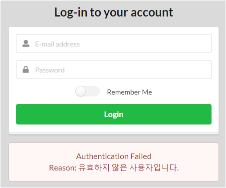

## 레시피 7-03-i 유저 인증하기 - 인메모리 방식으로 유저 인증

> 유저 인증 정보 저장소의 여려 종류를 알아본다.
>

### 이번 레시피에서 확인해야할  내용

* ✅ 인메모리 방식 

* ⬛ DB 조회 방식 

* ⬛ 패스워드 암호화 

* ⬛ LDAP 저장소 
  * 저자님 하신대로 도커 사용해야 편하겠다.

* ⬛ 유저 세부 캐시하기 
  * 이 내용은 자세하게 경험 해보질 않았는데.. 확실하게 하자.
    


## 진행

이미 인메모리 방식으로 사용중이긴 한데...

```java
  @Bean
  UserDetailsService userDetailsService() {
    val admin =
        User.withUsername("admin") //
            .password("{noop}admin")
            .authorities("USER", "ADMIN")
            .build();
    val user00 =
        User.withUsername("user00") //
            .password("{noop}user00")
            .authorities("USER")
            .build();
    // user01 (비활성 계정)
    val user01 =
        User.withUsername("user01") //
            .password("{noop}user01")
            .authorities("USER")
            .disabled(true)
            .build();

    return new InMemoryUserDetailsManager(admin, user00, user01);
  }
```

유저를 하나더 추가하고 비활성 계정으로 만들었다.



disabled()가 true로 설정된 유저로 로그인 하면 위와 같은 오류 메시지가 노출된다.


## 의견

* ...


---

## 기타

#### 나중에는 완료, 삭제 버튼에 대해서는 Ajax로 바꿔야할 것 같다.

삭제는 admin만 가능하기 때문에, user가 삭제 버튼을 누르면 403응답 기본 페이지가 노출된다.

* 해당 버튼을 Ajax 요청을 바꾸거나..

* 아니면 뷰를 노출할 때.. 삭제 버튼을 Admin일 때만 노출하게 하는 것도 낫겠다.

  ```html
          <th:block sec:authorize="hasAuthority('ADMIN')">
          <form th:action="@{|/todos/${todo.id}|}" method="post" style="float: left;">
            <input type="hidden" name="_method" value="DELETE"/>
            <button class="ui mini red icon button"><i class="remove circle icon"></i></button>
          </form>
          </th:block>
  ```

  * 위처럼 현재 로그인 유저가 `ADMIN` 권한을 가졌을 때만 삭제 버튼을 노출하게 해줘도 됨.


## 정오표

* ...
  


---

## JavaDocs

* ...
