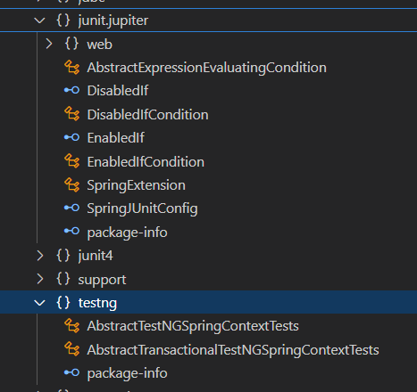

## 레시피 16-04-iii 통합 테스트 시 애플리케이션 컨텍스트 관리하기

> 또 예제를 미리 보았는데, 지금 시점에는 사용하지 않을 만한 클래스를 사용하는 부분이 보인다.
>
> 현 시점에 맞게 바꿔쓰자!

### 이번 레시피에서 확인해야할  내용

* ✔ **16-04-i**: JUnit에서 테스트 컨텍스트 프레임워크 가져오기 - ApplicationContextAware

* ✖️ **16-04-ii**: JUnit에서 테스트 컨텍스트 프레임워크 가져오기 - AbstractJUnit4SpringContextTests

* ✅ **16-04-iii**: TestNG에서 테스트 컨텍스트 프레임워크 가져오기 - AbstractTestNGSpringContextTests

  


## 진행

spring-test 라이브러리의 JUnit 5 지원은 좋지만 TestNG는 별로 지원이 없는 것 같다. 😅



* junit-jupiter 관련해서는 여러가지 어노테이션이나 헬퍼 클래스들이 보이는데, TestNG는 딱 2개 있음.


#### mockito-junit-jupiter처럼 TestNG도 mockito-testng라는 것이 있음..

* https://github.com/mockito/mockito-testng

* 그런데 Mockito 코어에 통합되어있는게 아니여서, Mocktio 최신버전하고 항상 잘 동작하게 될지는 잘 모르겠음.

* 동작을 확인했는데, 최신 Mockito 5.12.0 환경에서도 잘 동작했다.

  ```java
  @Listeners(MockitoTestNGListener.class)
  class AccountServiceImplMockTests {
    private static final String TEST_ACCOUNT_NO = "1234";
  
    @Mock private AccountDao accountDao;
    private AccountService accountService;
    // ...
  ```


### `AbstractTestNGSpringContextTests` 확장한 상태면 `@Autowired`가 잘 동작한다.  

* getBean으로 로드할 필요가 없음

  ```java
  @ContextConfiguration(classes = BankConfiguration.class)
  class AccountServiceTestNGContextTests extends AbstractTestNGSpringContextTests {
  
    private static final String TEST_ACCOUNT_NO = "1234";
  
    @Autowired private AccountService accountService;
    // ...
  ```

* TestNG도 그냥 클래스하고 메서드에 접근자를 public으로 안해도 되서 다 빼버렸다.


## 의견

* ...


---

## 기타

* ...


## 정오표

* ...
  


---

## JavaDocs

* ...


---

### 문서 사용 아이콘

* ✅: Current Done
* ✔: Done
* ⬜: TODO
* ✖️: Skip
* ...

